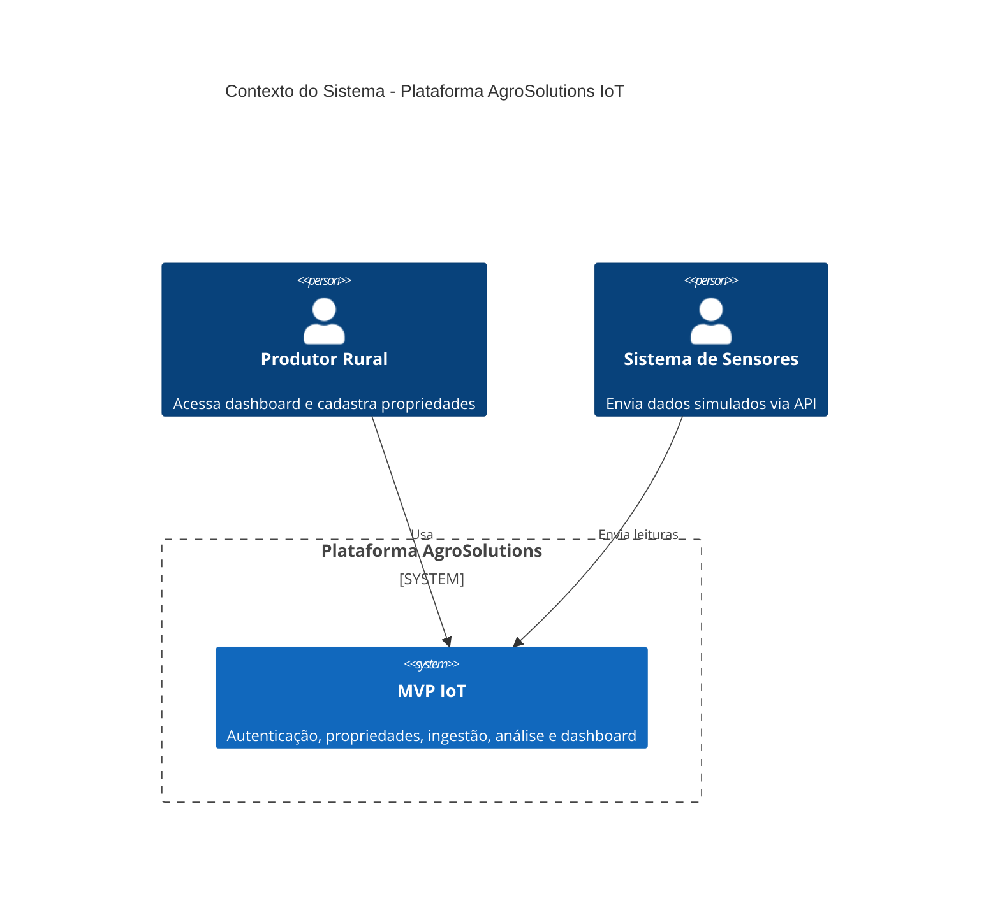
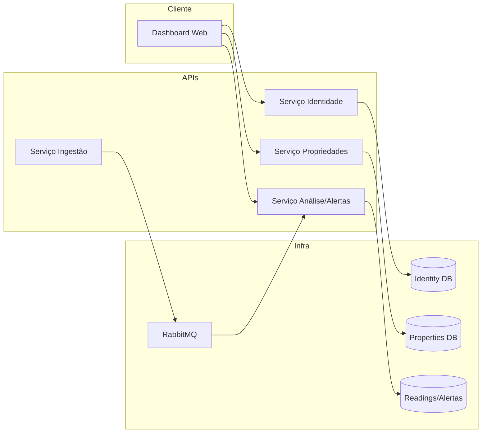

# Arquitetura da Solução MVP – AgroSolutions IoT

## Diagrama de alto nível (C4 – Contexto)

## Diagrama de microsserviços

## Stack

- **Backend:** .NET 8 (ASP.NET Core) – ecossistema maduro, desempenho, integração com Azure e Kubernetes.
- **Frontend:** React (fase posterior).
- **Banco:** SQLite (dev), PostgreSQL (produção).
- **Mensageria:** RabbitMQ ou Kafka.
- **Orquestração:** Kubernetes.

## Justificativa técnica (resumo)

| Decisão | Justificativa |
|---------|---------------|
| Microsserviços | Escalabilidade independente (ex.: ingestão sob carga), equipes podem evoluir serviços em paralelo. |
| Mensageria (RabbitMQ/Kafka) | Desacoplamento entre ingestão e processamento; ingestão não falha se o motor de alertas estiver lento. |
| Kubernetes | Orquestração padrão para deploy e escalonamento; atende requisito do hackathon. |
| Prometheus + Grafana | Observabilidade com métricas e dashboards; integração com ecossistema K8s. |
| JWT para auth | Stateless; serviços não precisam consultar identidade a cada request. |

## Requisitos não funcionais (NFRs)

- **Disponibilidade:** APIs com health check; mensageria garante reprocessamento em caso de falha do consumidor.
- **Segurança:** Autenticação JWT; senhas com hash (bcrypt/Argon2); HTTPS em produção.
- **Observabilidade:** Logs estruturados, métricas (Prometheus), dashboards (Grafana), alertas (Zabbix se exigido).
- **Testabilidade:** Testes unitários por serviço; CI com build e testes a cada push.
